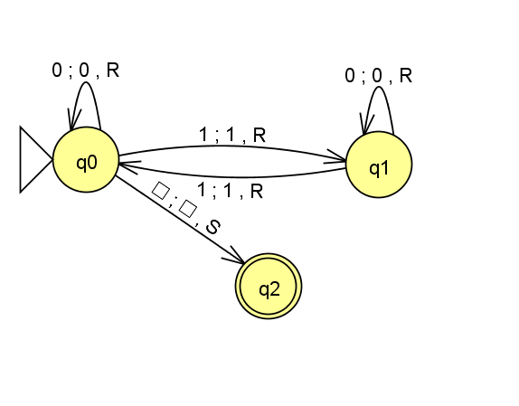

# TP Máquina de Turing Universal
---

1. **Codificación de una máquina simple**  
   * Definir una máquina $M$ que ...
   * Codificar sus estados, símbolos y transiciones en forma numérica

#### Definición de la MT M

M = ⟨{0, 1, □}, {0, 1}, □, {q0, q1, q2}, q0, {q2}, δ⟩

|   Q	 |      0	    |      1	   |      □
|------|------------|------------|---------------
| >q0	 | (q0, 0, R) |	(q1, 1, R) | (q2, □, R)
| q1	 | (q1, 0, R) |	(q0, 1, R) |     -
| *q2	 |      -	    |       -	   |     -

#### Codificación de elementos
* Símbolos:
0 = 00, 1 = 01, □ = 10
* Estados:
q0 = 00, q1 = 01, q2 = 10
* Movimientos:
L = 1, R = 0

#### Codificación de transiciones
|   Q	 |      00	   |      01	   |      10
|------|-------------|-------------|---------------
| >00  | (00, 00, 0) | (01, 01, 0) | (10, 10, 0)
| 01	 | (01, 00, 0) | (00, 01, 0) |      -
| *10	 |      -	     |      -	     |      -


#### Entrada para la MTU
donde:
* ⟨M,w⟩
* ⟨M⟩ es la lista de transiciones codificadas
w es la cadena de entrada, por ejemplo 001100□


```python
Ejemplo de entrada codificada:

*000101000010$0000#000000000#000101010#001010100#010001000#010100010 -> uso 000000000
00*0101000010$0000#000000000#000101010#001010100#010001000#010100010 -> uso 000000000
0000*01000010$0001#000000000#000101010#001010100#010001000#010100010 -> uso 000101010
000001*000010$0101#000000000#000101010#001010100#010001000#010100010 -> uso 010100010
00000101*0010$0000#000000000#000101010#001010100#010001000#010100010 -> uso 000000000
0000010100*10$0000#000000000#000101010#001010100#010001000#010100010 -> uso 000000000
000001010000*$0010#000000000#000101010#001010100#010001000#010100010 -> uso 001010100
00000101000010*$1010#000000000#000101010#001010100#010001000#010100010 -> ACEPTA

```

2. **Simulación básica**  
   * Implementar en Python un programa que reciba:
     * La codificación de una máquina $M$
     * Una cadena de entrada $w$
   * El programa debe simular paso a paso la ejecución de $M$ sobre $w$


```python
registros = ["000000000", "000101010", "001010100", "010001000", "010100010"]
w = "101101"
print("Cadena de entrada:", w)
estado = "00"    # estado inicial 
finales = ["10"] # estados finales

# Codificación de símbolos 
simbolos = {"0": "00", "1": "01"} 
blanco = "10"

# Cinta
cinta = []
for i in w:
    cinta.append(simbolos[i])
cinta.append(blanco) #['00', '00', '01', '01', '00', '00, '10']

cabezal = 0  # posicion del cabezal
pasos = 0

while True:
    simb_leido = cinta[cabezal]

    cadena = "".join(cinta[:cabezal]) + "*" + "".join(cinta[cabezal + 1:]) # reemplaza el símbolo bajo el cabezal con un *
    print(cadena + "$" + estado + simb_leido + "#" + "#".join(registros), end=" ")

    # Buscar el registro que empieza con estado + simbolo leido
    registro = None
    for r in registros:
        if r.startswith(estado + simb_leido): #startswith() devuelve True si la cadena comienza con el prefijo especificado
            registro = r

    if registro is None:
        print("-> no hay registro para continuar")
        break
    print("-> uso", registro)

    estado_nuevo = registro[4:6] #ej: 0001 01 010 -> estado_nuevo = 01
    escribe = registro[6:8] #ej: 000101 01 0 -> escribe = 01
    mov = registro[8] #ej: 00010101 0 -> muevo hacia = 0

    cinta[cabezal] = escribe # simbolo a escribir
    if mov == "0":  # 0 = R
        cabezal = cabezal + 1
        if cabezal == len(cinta):
            cinta.append(blanco) #agrego blanco al final de la cinta
    else: # 1 = L
        if cabezal == 0:
            cinta.insert(0, blanco) #agrego blanco al inicio de la cinta
        else:
            cabezal = cabezal - 1 #retrocedo el cabezal a la izquierda
    estado = estado_nuevo  # actualizo el estado
    pasos += 1

if estado in finales: # si llego a un estado final, acepto la cadena, sino rechazo
    print("ACEPTA")
    print("Número de pasos:", pasos)
else:
    print("RECHAZA")
    print("Número de pasos:", pasos)
```

3. **Pruebas de funcionamiento**  
   * Probar la simulación con diferentes entradas
   * Documentar los resultados


```python
Cadena de entrada: λ
*$0010#000000000#000101010#001010100#010001000#010100010 -> uso 001010100
10*$1010#000000000#000101010#001010100#010001000#010100010 -> no hay registro para continuar
ACEPTA
Número de pasos: 1
```


```python
Cadena de entrada: 000
*000010$0000#000000000#000101010#001010100#010001000#010100010 -> uso 000000000
00*0010$0000#000000000#000101010#001010100#010001000#010100010 -> uso 000000000
0000*10$0000#000000000#000101010#001010100#010001000#010100010 -> uso 000000000
000000*$0010#000000000#000101010#001010100#010001000#010100010 -> uso 001010100
00000010*$1010#000000000#000101010#001010100#010001000#010100010 -> no hay registro para continuar
ACEPTA
Número de pasos: 4
```


```python
Cadena de entrada: 0110
*01010010$0000#000000000#000101010#001010100#010001000#010100010 -> uso 000000000
00*010010$0001#000000000#000101010#001010100#010001000#010100010 -> uso 000101010
0001*0010$0101#000000000#000101010#001010100#010001000#010100010 -> uso 010100010
000101*10$0000#000000000#000101010#001010100#010001000#010100010 -> uso 000000000
00010100*$0010#000000000#000101010#001010100#010001000#010100010 -> uso 001010100
0001010010*$1010#000000000#000101010#001010100#010001000#010100010 -> no hay registro para continuar
ACEPTA
Número de pasos: 5
```


```python
Cadena de entrada: 101101
*000101000110$0001#000000000#000101010#001010100#010001000#010100010 -> uso 000101010
01*0101000110$0100#000000000#000101010#001010100#010001000#010100010 -> uso 010001000
0100*01000110$0101#000000000#000101010#001010100#010001000#010100010 -> uso 010100010
010001*000110$0001#000000000#000101010#001010100#010001000#010100010 -> uso 000101010
01000101*0110$0100#000000000#000101010#001010100#010001000#010100010 -> uso 010001000
0100010100*10$0101#000000000#000101010#001010100#010001000#010100010 -> uso 010100010
010001010001*$0010#000000000#000101010#001010100#010001000#010100010 -> uso 001010100
01000101000110*$1010#000000000#000101010#001010100#010001000#010100010 -> no hay registro para continuar
ACEPTA
Número de pasos: 7
```


```python
Cadena de entrada: 111
*010110$0001#000000000#000101010#001010100#010001000#010100010 -> uso 000101010
01*0110$0101#000000000#000101010#001010100#010001000#010100010 -> uso 010100010
0101*10$0001#000000000#000101010#001010100#010001000#010100010 -> uso 000101010
010101*$0110#000000000#000101010#001010100#010001000#010100010 -> no hay registro para continuar
RECHAZA
Número de pasos: 3
```


```python
Cadena de entrada: 0111011
*01010100010110$0000#000000000#000101010#001010100#010001000#010100010 -> uso 000000000
00*010100010110$0001#000000000#000101010#001010100#010001000#010100010 -> uso 000101010
0001*0100010110$0101#000000000#000101010#001010100#010001000#010100010 -> uso 010100010
000101*00010110$0001#000000000#000101010#001010100#010001000#010100010 -> uso 000101010
00010101*010110$0100#000000000#000101010#001010100#010001000#010100010 -> uso 010001000
0001010100*0110$0101#000000000#000101010#001010100#010001000#010100010 -> uso 010100010
000101010001*10$0001#000000000#000101010#001010100#010001000#010100010 -> uso 000101010
00010101000101*$0110#000000000#000101010#001010100#010001000#010100010 -> no hay registro para continuar
RECHAZA
Número de pasos: 7
```

4. **Informe final**  
   * Explicar la codificación utilizada
   * Mostrar ejemplos de ejecución
   * Reflexionar sobre la relación entre la MTU y las computadoras modernas

### Codificación utilizada
**MT elegida:** 
* Se eligio la máquina M que reconoce cadenas con un número par de 1's. Recorre la cadena de izquierda a derecha, cambiando de estado cada vez que encuentra un 1. q0 es el estado inicial y q2 es el estado de aceptación. La máquina termina cuando encuentra el símbolo □(blanco).

M = ⟨{0, 1, □}, {0, 1}, □, {q0, q1, q2}, q0, {q2}, δ⟩

|   Q	 |      0	    |      1	   |      □
|------|------------|------------|---------------
| >q0	 | (q0, 0, R) |	(q1, 1, R) | (q2, □, R)
| q1	 | (q1, 0, R) |	(q0, 1, R) |     -
| *q2	 |      -	    |       -	   |     -



**Codificación de símbolos:** 
* Símbolos:
0 = 00, 1 = 01, □ = 10
* Estados:
q0 = 00, q1 = 01, q2 = 10
* Movimientos:
L = 1, R = 0

**Registro de transiciones:**
| Transición           | Registro |
|----------------------|----------|
| (q0, 0) = (q0, 0, R) | 000000000|
| (q0, 1) = (q1, 1, R) | 000101010|
| (q0, □) = (q2, □, R) | 001010100|
| (q1, 0) = (q1, 0, R) | 010001000|
| (q1, 1) = (q0, 1, R) | 010100010|

**Funcionamiento:**
1. Busca el registro que empieze con el estado actual + el símbolo leído.
2. Escribe el simnolo nuevo donde estaba el *(cabezal).
3. Mueve el * segun el movimiento indicado.
4. Cambia el estado actual al nuevo estado y el simbolo leído despues del $.

Si no encuentra un registro que coincida con el estado actual y el símbolo leído, la MTU rechaza la cadena. Si llega al estado de aceptacion(q2), la MTU acepta la cadena.

### Ejemplos de ejecucion
**Ejemplo 1: w = λ (cero 1s) -> ACEPTA**

```
*$0010#000000000#.... -> uso 001010100
10*$1010#.... -> no hay registro para continuar
ACEPTA
```

**Ejemplo 2: w = 000 (cero 1s) -> ACEPTA**

```
*000010$0000#... -> uso 000000000
00*0010$0000#... -> uso 000000000
0000*10$0000#... -> uso 000000000
000000*$0010#... -> uso 001010100
00000010*$1010#... -> no hay registro para continuar
ACEPTA

```


**Ejemplo 3: w = 0110 (dos 1s) -> ACEPTA**
```
*01010010$0000#... -> uso 000000000
00*010010$0001#... -> uso 000101010
0001*0010$0101#... -> uso 010100010
000101*10$0000#... -> uso 000000000
00010100*$0010#... -> uso 001010100
0001010010*$1010#... -> no hay registro para continuar
ACEPTA
```

**Ejemplo 4: w = 101101 (cuatro 1s) -> ACEPTA**
```
*000101000110$0001#... -> uso 000101010
01*0101000110$0100#... -> uso 010001000
0100*01000110$0101#... -> uso 010100010
010001*000110$0001#... -> uso 000101010
01000101*0110$0100#... -> uso 010001000
0100010100*10$0101#... -> uso 010100010
010001010001*$0010#... -> uso 001010100
01000101000110*$1010#... -> no hay registro para continuar
ACEPTA
```
**Ejemplo 4: w = 0111011 (cinco 1s) -> RECHAZA**

```
*01010100010110$0000#... -> uso 000000000
00*010100010110$0001#... -> uso 000101010
0001*0100010110$0101#... -> uso 010100010
000101*00010110$0001#... -> uso 000101010
00010101*010110$0100#... -> uso 010001000
0001010100*0110$0101#... -> uso 010100010
000101010001*10$0001#... -> uso 000101010
00010101000101*$0110#... -> no hay registro para continuar
RECHAZA
```
La MTU rechaza la cadena porque no hay un registro que coincida con el estado actual y el símbolo leído (0110) por lo que no puede continuar y queda en el estado q1(01), que no es un estado de aceptación.

**Ejemplo 5: w = 111 (tres 1s) -> RECHAZA**

```
*010110$0001#... -> uso 000101010
01*0110$0101#... -> uso 010100010
0101*10$0001#... -> uso 000101010
010101*$0110#... -> no hay registro para continuar
RECHAZA
```
La MTU rechaza la cadena porque no hay un registro que coincida con el estado actual y el símbolo leído (0110) por lo que no puede continuar y queda en el estado q1(01), que no es un estado de aceptación.

### Relación entre la MTU y las computadoras modernas
La MTU es una maquina capaz de ejecutar cualquier otra maquina de Turing. Esa idea es el origen de la computadora de prorama almacenado: una computadora que guarda las instruccines del programa en su memoria y trata programas y datos de la misma manera. Por eso una misma computadora sirve para navegar, editar texto o jugar, simplememte cambiando el programa que ejecuta. Segun la fuente, la idea se remonta a la maquina universal de Turing y von Neumann era consciente de ello. 

Von Neumann tomó las ideas abstractas de Turing y propuso que tanto los datos como los programas se guarden juntos en la misma memoria física(RAM) pero tiene la desventaja de que no se puede leer y escribir al mismo tiempo en la memoria. La arquitectura propuesta por Harvard tiene memorias separadas para datos y programas, lo que permite leer y escribir al mismo tiempo pero es más costosa y compleja de implementar.

Las computadoras actuales son el resultado directo de fusionar las ideas de estos tres pioneros: Alan Turing definió la lógica de qué puede hacer una computadora, John von Neumann diseñó la estructura física ideal para comercializarlas, y la Arquitectura Harvard aportó la velocidad necesaria para los procesadores modernos.

*Fuente: Wikipedia, "Computador de programa almacenado" (https://es.wikipedia.org/wiki/Computador_de_programa_almacenado) - Wikipedia, "Arquitectura de von Neumann" (https://es.wikipedia.org/wiki/Arquitectura_de_von_Neumann) - Wikipedia, "Arquitectura Harvard" (https://es.wikipedia.org/wiki/Arquitectura_Harvard).*


